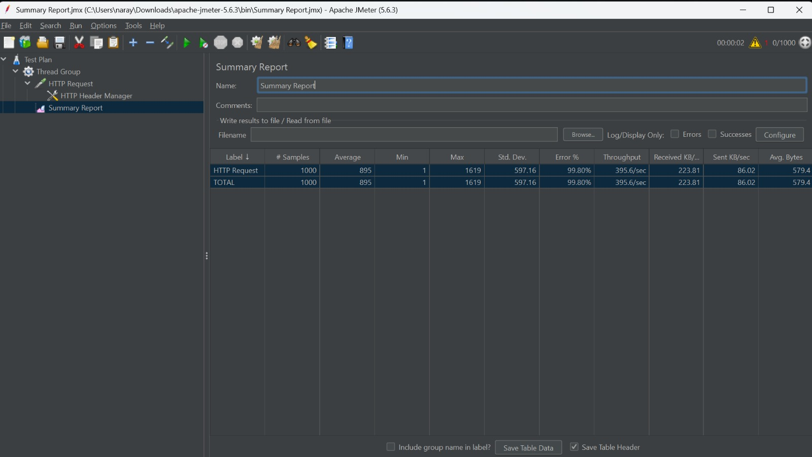
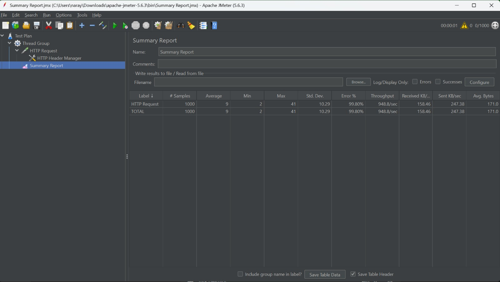

# Core Ticketing Engine

A backend ticketing REST API built with Go, exploring production-grade
patterns for data consistency, concurrent safety, and clean architecture
used in high-traffic ticket platforms (e.g. concert/event ticketing).

## Why This Project

Most Go tutorials stop at "build a REST API." This project intentionally
goes further — exploring what happens when multiple users hit the same
ticket simultaneously, and how to handle it correctly at the database
level before adding any caching layer on top.

## Architecture

Clean Architecture with layered separation:
- **Delivery** — HTTP handlers (stdlib net/http + ServeMux)
- **Use Case** — business logic
- **Repository** — data access via raw SQL (sqlx)
- **Domain** — core entities and interfaces

## Tech Stack

Go 1.25 · PostgreSQL · sqlx · Docker · Docker Compose

## What's Implemented

- Ticket creation and retrieval with Clean Architecture
- ACID-compliant transactions via sqlx to prevent data inconsistency
- Raw SQL with DTO pattern for type-safe data transfer
- Pessimistic locking (`SELECT FOR UPDATE`) to serialize concurrent
  ticket purchases and prevent overselling
- Connection pool tuning to eliminate connection acquisition bottleneck
  under high concurrency
- Containerized PostgreSQL via Docker Compose

## Engineering Decisions

The central problem: what happens when 10,000 users hit
"Buy" on the same ticket simultaneously?

| Failure Mode | Without Fix | Solution |
|---|---|---|
| Two users buy the last ticket at the same millisecond | Oversell — both get confirmation | Pessimistic locking (`SELECT FOR UPDATE`) — DB serializes concurrent buyers |
| Payment succeeds but reservation fails | User charged, no ticket received | ACID transaction — debit + reservation are atomic (all or nothing) |
| Raw DB object sent to client | Internal pricing logic / IDs exposed | DTO pattern — explicit data contract between domain and presentation |
| 10k users refresh ticket availability per second | PostgreSQL hammered with identical reads | Redis cache — serve from memory, DB only hit on cache miss *(in progress)* |

## Load Test Results — Thundering Herd Scenario

**Setup:** 1,000 concurrent users (1-second ramp-up) targeting the same
ticket endpoint simultaneously. Initial stock: 5 tickets, each request
attempts to purchase qty = 2.

| Phase | Avg Latency | Throughput | Data Integrity |
|---|---|---|---|
| No pessimistic locking | — | — | X Fatal — stock went deeply negative, thousands of phantom transactions |
| Locking, no pool tuning | 895ms | 395.6/sec | ✓ Exact — 2 purchases, 998 correctly rejected, 0 oversells |
| Locking + connection pool tuning | **9ms** | **948.8/sec** | ✓ Exact — 2 purchases, 998 correctly rejected, 0 oversells |

**Key finding:** The 886ms gap between phase 2 and phase 3 was entirely
connection acquisition overhead — not query execution time. Pool tuning
revealed the actual query performance.

<details>
<summary>JMeter Screenshots</summary>

**Phase 2 — Pessimistic locking, no pool tuning (895ms avg):**



**Phase 3 — Pessimistic locking + connection pool tuning (9ms avg):**



</details>

## In Progress

- **Redis caching layer** — in-memory read cache to absorb high-frequency
  ticket availability queries without hitting PostgreSQL on every request

## Run Locally

```bash
docker-compose up -d     # start PostgreSQL
go run ./cmd/api         # start server
```
